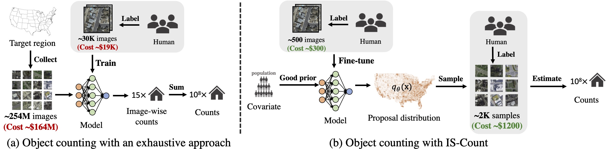

# IS-Count: Large-scale Object Counting with Importance Sampling (AAAI 2022)

\[[**Paper**](https://arxiv.org/abs/2112.09126) | [**Website**](https://is-count.github.io/) | **Colab (coming soon)**]

[Chenlin Meng](https://cs.stanford.edu/~chenlin/), [Enci Liu](https://jesscel.github.io/), [Willie Neiswanger](https://willieneis.github.io/), [Jiaming Song](https://tsong.me/), [Marshall Burke](http://web.stanford.edu/~mburke/), [David B. Lobell](https://fse.fsi.stanford.edu/people/david_lobell), [Stefano Ermon](https://cs.stanford.edu/~ermon/)

**Stanford University**

IS-Count is a sampling-based and learnable method for estimating the total object count in a region. It largely reduces the number of satellite images as well as human annotations compared to an exhaustive approach used by object detectors in many real-world counting tasks, while achieving a high accuracy.  



## Table of Contents

* [Overview](#overview)
* [Requirements](#requirements)
* [Tutorials](#tutorials)
* [Data Preparation](#data-preparation)
* [Running Identity Models](#running-identity-models)
* [Running Isotonic Models](#running-isotonic-models)
* [Citation](#citation)


## Overview
We consider the following four tasks across 45 countries: 
1. Counting buildings in the US and 43 African countries
2. Counting cars in Kenya
3. Counting brick kilns in Bangladesh
4. Counting swimming pools in the US

## Requirements

The code has been tested on PyTorch 1.7.1 (CUDA 11.2).

To install necessary packages and dependencies, run
```
pip install -r requirements.txt
conda install gdal
```

## Tutorials

The IS-Count pipeline could be divided into two steps: 1) data preparation and 2) object count estimation. We provide the code for the two steps with the example of estimating building count in New York State in the `tutorials/` folder.

## Data Preparation

We provide code for preparing the necessary data for IS-Count in `create_mask.py` and `create_data.py`. Before running these scripts, you need to make sure you have the prerequisite data downloaded and organized as described in the file `data/README.md`. For more details on preparing the necessary data for running IS-Count, check out the `data_prep_tutorial.ipynb` notebook under `data/`.

### Preparing binary mask
To create the binary mask for the region of interest, run `create_mask.py` with the following command
```
python create_mask.py --sampling_method "$sampling_method" --district "$district" --overwrite
```

### Preparing training & testing data for the target region
To create the all-pixel file for the region of interest, run `create_data.py` with the following command
```
python create_data.py --sampling_method "$sampling_method" --district "$district" --overwrite
```

## Running Identity Models

We provide code to reproduce our results on counting buildings and brick kilns using uniform, NL-based, and Population-based identity models in `baselines.py`. To reproduce the results for all the three identity methods, run the following command:
```
for sampling_method in "uniform" "NL" "population"
do
  echo "$sampling_method"
  python baselines.py --sampling_method "$sampling_method" --percentage 0.02 --plot
done
```

## Running Isotonic Models

We provide code to reproduce our results on counting buildings and brick kilns using uniform, NL-based, and Population-based isotonic models in `isotonic_regression.py`.
```
for sampling_method in "NL" "population"
do
  echo "$sampling_method"
  python isotonic_regression.py --sampling_method "$sampling_method" --percentage 0.0001 --plot
done
```
To get results for the **Isotonic** method in the paper, run with the `--extra_train` flag.

## Citation

Please cite this article as follows, or use the BibTeX entry below.

> citation

```tex
@inproceedings{meng2022count,
  title={Is-count: Large-scale object counting from satellite images with covariate-based importance sampling},
  author={Meng, Chenlin and Liu, Enci and Neiswanger, Willie and Song, Jiaming and Burke, Marshall and Lobell, David and Ermon, Stefano},
  booktitle={Proceedings of the AAAI Conference on Artificial Intelligence},
  volume={36},
  number={11},
  pages={12034--12042},
  year={2022}
}
```
